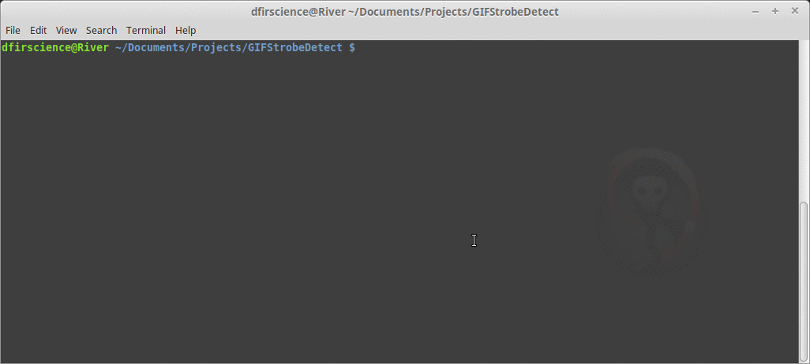

## GIFStrobeDetect

A bash and imagemagick gif strobe detector. Attempts to detect major shifts in color
that could be problematic for some people. It's a filter POC.

## Why?

This script is a bit of a rage-program based on the following tweet:

<blockquote class="twitter-tweet">
Developing an anti-strobe filter for GIFs and videos seems like it can’t be that hard. Maybe someone will release such a thing and Twitter will adopt it? <a href="https://t.co/V8KXa8gwb7">https://t.co/V8KXa8gwb7</a>
&mdash; Matthew Green (@matthew_d_green) <a href="https://twitter.com/matthew_d_green/status/1206761811346939904?ref_src=twsrc%5Etfw">December 17, 2019</a></blockquote>

If anything, I hope it raises awareness about how vulnerable some groups are to physical attacks online.
See the original article [here](https://www.nytimes.com/2019/12/16/us/strobe-attack-epilepsy.html).

## The problem

Based on this practice script, certain types of strobe strobing in GIFs are trivial to detect. Others appear
a little more complicated. However, I have a detector working on the transparency changes in less than an hour using only bash and imagemagick.

## Contributing

The data directory has some samples where 0 is not strobe and 1 is strobe. The strobe set has
different problems to solve.

If you would like to contribute different strobe problem sets or detection code, please send me a pull request.
